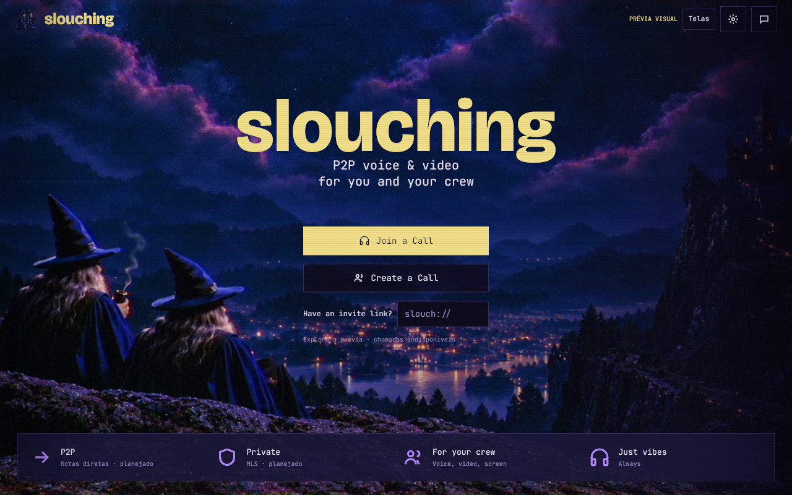
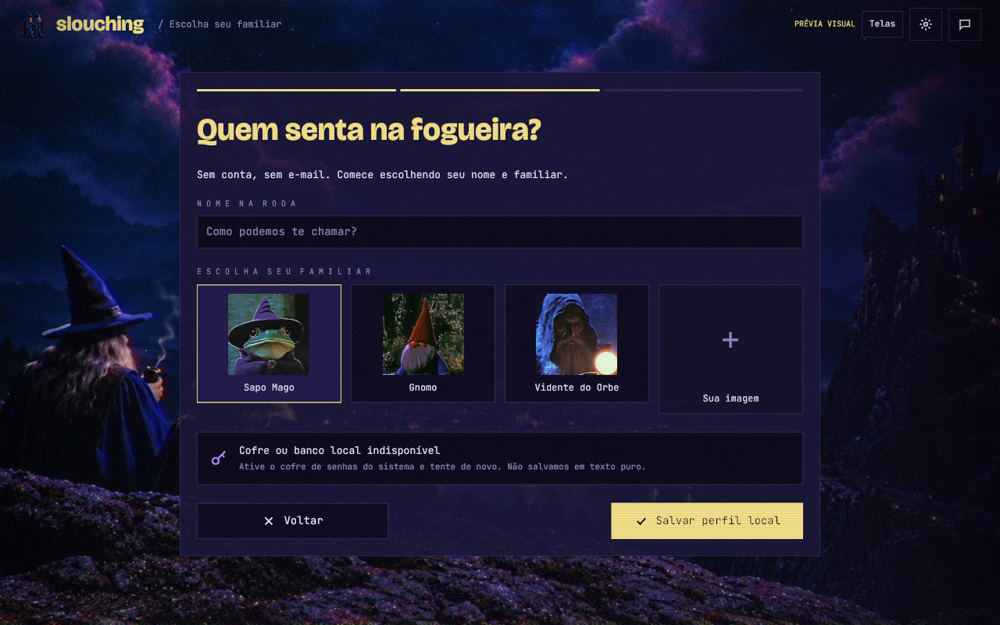
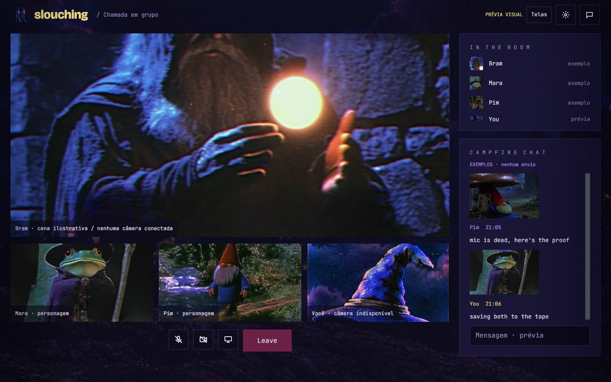
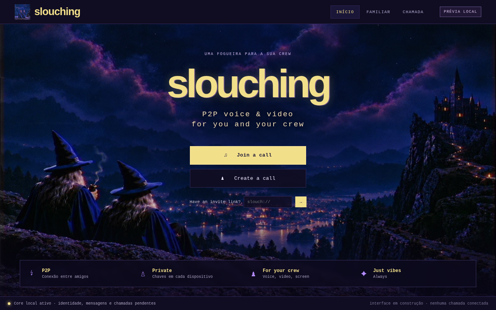
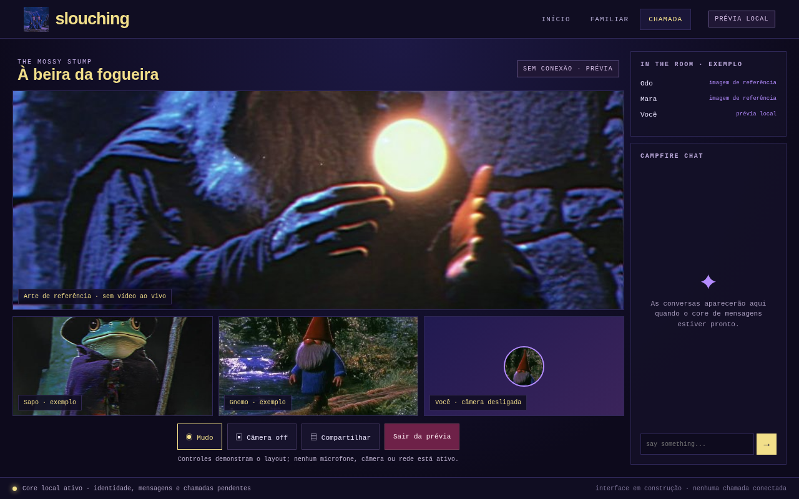
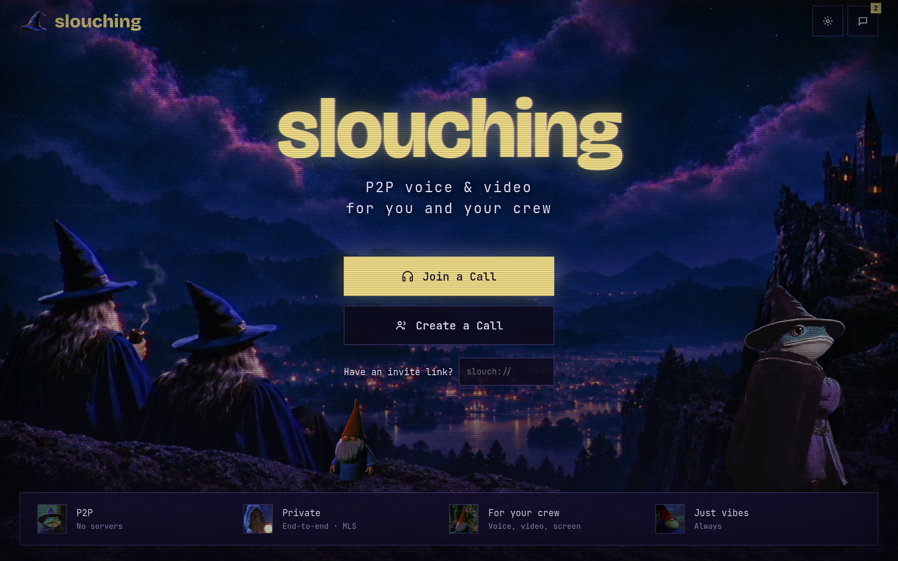
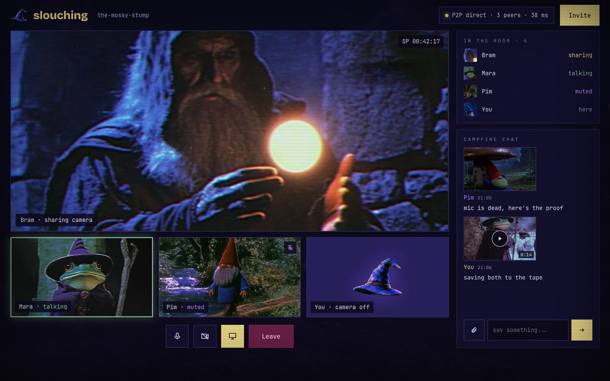

<p align="center">
  
</p>

<h1 align="center">slouching</h1>

<p align="center"><em>Pull up a chair. The internet can wait outside.</em></p>

<p align="center">
  
  
  
  
</p>

**Conceived by Rodrigo and Vitchola**, Slouching is an early native desktop app for a small crew to chat, call, and share a screen. The Rust/Iced client owns local keys, cryptography, direct peer paths, and per-peer chat history and pinned peer routes in encrypted SQLite. Elixir remains the backend language. A member may optionally host a helper on a PC or VPS for ciphertext delivery, discovery, relay, or group media. Pinned-device text works over manually addressed reachable UDP routes without a hosted helper or PostgreSQL.

> [!IMPORTANT]
> This is an early build, **not a secure messenger**. Direct pinned-device text and MLS application messaging work over Iroh/QUIC when a manually supplied UDP route is reachable. The MLS screen can send a device-bound KeyPackage through a pinned session, where the committer reviews and admits it. The committer saves the Welcome and ratchet tree in an encrypted retry queue and resends them when the pinned invitee reconnects. The invitee records a content-bound receipt with group admission, so duplicate delivery after a lost ACK returns the existing group. The receiver validates and persists ciphertext, ratchet state, and transcript in SQLCipher before ACK. Each application event snapshots eligible member devices; per-device ACKs keep other recipients queued, and the MLS screen can retry one pinned member or fan out over saved routes. If a recipient route is unavailable, that fan-out action tries a reachable routed group member that opted into retaining signed ciphertext copies. A reconnecting recipient fetches copies addressed to its device, verifies the author grant and persists the event before the helper erases it. Helper ACKs are reported separately from recipient delivery, and retention remains best-effort. Membership Commits are stored atomically with the committer's new group epoch. When a pinned group member connects, its eligible pending Commits start sending automatically, one at a time with a durable ACK before advancing. The committer can also distribute queued Commits sequentially to all eligible members with saved routes; unavailable peers remain queued. Exact redelivery is harmless. Clients detect authenticated committer equivocation against saved historical OpenMLS state, preserve both conflicting Commits, and quarantine the affected group without changing its accepted epoch. The client now supports an explicitly configured, token-protected Iroh Relay 1.3 route, covered by a local end-to-end message/ACK test; remote TLS deployment and cross-network VPN use have not been verified. Signed QR invitations now exchange device keys and announced addresses, but imported images do not automatically establish human trust. SFrame frame protection now has a dedicated MLS call-group purpose and a guarded, zeroizing MLS exporter; the call screen does not create those groups yet. WebRTC, live media, camera capture, group discovery, short codes, calls, and screen sharing remain unimplemented. The Elixir backend uses SQLite locally; PostgreSQL is an optional deployment choice. The older Rust `slouching-peer` crate is an experiment, not the service backend.

Members can also send a signed MLS self-update proposal to the designated
committer over the active pinned peer session, with copy/paste over a separately
trusted channel as a fallback. The committer binds the MLS author to the pinned
device and saves the authenticated proposal before ACK or Commit generation.
The committer explicitly approves or rejects each current-epoch proposal;
only approved proposal references enter the Commit. Decisions persist in the
encrypted local profile. Other MLS proposal types remain unsupported.

The identity screen signs a 10-minute QR invite containing the device key and,
when a listener is active, its announced addresses. PNG import verifies the
signature and offers each address as a route choice. It does not identify the
human behind an image or mark the key trusted; users must authenticate the QR
source or compare the complete key independently. Camera scanning and short
verification codes remain unimplemented. See the [invite format and trust
boundary](docs/fichas/identity/pairing-invite-v1.md).

The native client now contains an internal file-transfer crypto foundation:
random per-file keys, authenticated 48 KiB chunks, a 100 MiB bound, ciphertext
digests, bounded streaming encryption/decryption, a filename-only offer format,
and an encrypted persistent iroh-blobs store with an explicit peer-authorization
gate. The desktop app has a private per-user store location and a bounded
ciphertext import that checks length and digest before adding a persistent
reference. Stored ciphertext can be decrypted chunk by chunk and published to
a destination only after AEAD and ciphertext-digest validation, without
replacing an existing file; Unix staging files use mode 0600. A local
two-endpoint QUIC test covers authorized retrieval and rejects an
unauthorized peer. The peer layer also has a separate unidirectional QUIC
stream for sending ciphertext against a group-bound offer, with a two-endpoint
transfer-and-save test. The bounded receive-store path stages ciphertext in a
private temporary file and rejects streams whose size or digest differs from
the MLS offer before adding a blob reference. Its plaintext receive core
stages data and publishes it only after digest validation, without replacing
an existing destination. The MLS composer imports and encrypts a chosen file,
sends its offer as an MLS event, and starts a separate QUIC ciphertext stream
after the receiver ACKs that event. The receiver checks active membership in
that MLS group and the exact stored offer before importing the bounded stream.
The attachment card can save by decrypting to a chosen path and publishing
only after integrity checks. Failed outbound streams can be retried while the
app remains open. The separate two-endpoint stream test covers transfer and
save; the full database-authorized desktop flow and cross-machine file
transfer still need runtime validation. Offer persistence in SQLCipher has
group-state checks, idempotent retries, member-device validation, transfer-ID
conflict checks, and a 200 MiB per-profile quota. The pinned iroh-blobs
0.103.1 release is marked by its maintainers as not production quality, so
this remains experimental.

The MLS screen lists local groups with their current epoch and quarantine state;
opening a saved group restores its transcript and security state from SQLCipher.






The audio settings list real devices available to the current system session.
The selected input/output stays in memory and is not connected to calls. An
explicit local microphone test shows input level without saving or sending
samples; voice and video calls remain unimplemented.




The earlier local web preview remains available for design comparison. These are captures of that preview, with illustrative people and video tiles; they show no live peers or media.

| Web home preview | Web call layout preview |
| --- | --- |
|  |  |

## Repositories and documentation

This repository holds the project overview, design sources, and a reconciled documentation set. Product code lives in separate repositories, also listed as Git submodules here:

| Repository | Owns | Current state |
| --- | --- | --- |
| [slouching-frontend](https://github.com/slouching-org/slouching-frontend) | Native Rust/Iced desktop UI and web visual prototype | Eleven design-board views plus MLS group chat; manually addressed pinned Iroh/QUIC transport; SQLCipher transcript and retryable outbox |
| [slouching-backend](https://github.com/slouching-org/slouching-backend) | Elixir service backend | Local SQLite Repo, no-PostgreSQL smoke check, and transport diagnostics; PostgreSQL deployment option; no enrollment or product traffic |

Start with the [fichas index](docs/fichas/README.md). The [product specification](docs/fichas/architecture/backend.md), [Elixir backend boundary](docs/fichas/architecture/elixir-backend.md), [frontend screen specification](docs/fichas/frontend/screens.md), [technology plan](docs/fichas/architecture/tech-stack.md), and [ADRs](docs/fichas/README.md#accepted-decisions) describe the target and distinguish it from working code. The [owner's 11-page architecture PDF](docs/fichas/architecture/sources/architecture-p2p-v0.1.pdf) and [page-by-page transcript](docs/fichas/architecture/sources/README.md) are preserved. [ADR 0005](docs/fichas/architecture/adr-0005-elixir-server-core.md) defines the Rust-client/Elixir-backend division. [ADR 0006](docs/fichas/architecture/adr-0006-local-storage-optional-helper.md) reaffirms the backup specification: local SQLite, optional helpers, and PostgreSQL only as a deployment option.

The [client/server integration contract](docs/fichas/architecture/integration.md) describes both the local Elixir diagnostics and the separate direct-peer text path. The diagnostics establish reachability and wire compatibility only. Direct peer text and MLS messages use the separate pinned Iroh/QUIC path.

The Elixir helper uses SQLite for local development and can select PostgreSQL for a deployment with `SLOUCHING_DATABASE_URL`. Its device-key table has no enrollment or lookup route and does not establish a required directory service. The desktop product stores its own encrypted local data in SQLCipher SQLite.

ADR 0004 changed the original single-workspace plan to [separate repositories](docs/fichas/architecture/adr-0004-separate-repositories.md). Its old Rust-backend wording is corrected by ADR 0005. The [old workspace ADR](docs/fichas/architecture/archive/adr-0004-workspace-superseded.md) is retained only as history.

## Design sources

The [source bank](docs/fichas/brand/source-bank.md) includes the original HTML board, all eleven exported screens, original scene and avatar JPEGs, and five earlier visual references. The [visual style](docs/fichas/brand/visual-style.md) documents the palette and treatment. The two walking wizards are the primary pictorial logo; the hat is a provisional small icon. Screen exports are design targets, not working app states.

| Home reference | Group call reference |
| --- | --- |
|  |  |

## Run the app and local backend

Initialize the two code submodules, then run the service and desktop client in
separate terminals from this repository:

```sh
git submodule update --init --recursive
cd repositories/backend/server
mix deps.get
mix ecto.create
mix ecto.migrate --pool-size 1
mix test
mix run --no-halt
```

In a second terminal, from the project root, run the client. Its Rust build
requires `protoc` for protobuf code generation. The Elixir process is only
needed for local status/WebSocket diagnostics; direct LAN messages and their
local history do not use it.

```sh
cd repositories/frontend
cargo check
cargo run
```

The development status uses `127.0.0.1:3707/api/status`; the binary handshake
uses `ws://127.0.0.1:3707/ws`. Neither is authenticated product traffic. Run
`./scripts/check-integration.sh` from the project root for cross-repository
checks. The submodules pin the published backend and frontend commits,
including native runtime screenshots.

To use direct peer messaging, open the **chat** screen in both clients. Create
an identity in **Familiar** if needed, then use **Copiar minha chave pública**
and exchange the two keys over a trusted channel. Each person pastes the
other's key into **Chave pública do peer**: the listener pins the sender's key,
and the sender pins the listener's key. The receiving device selects a UDP
port and clicks **Aguardar peer**; use the copy button beside the address for
the reachable interface and share it with the sender. For a VPN test, share
the listener's VPN IP with that same UDP port and allow inbound UDP in its
firewall. The VPN must route UDP between both devices. The sender enters the
listener's address, writes a message, and clicks
**Conectar e enviar**. Once connected, either side can send multiple messages
over that session; use **Desconectar sessão** to close it. **Apagar histórico
local deste peer** removes only this peer's local transcript after confirmation.
To exchange identity keys, each person can show a signed QR on **Conferir
identidade do peer**, save a screenshot as PNG, and import it on the other
device. After the listener starts, show a fresh QR to include its active
addresses; import it and choose the LAN or VPN route. QR import does not
automatically mark a contact trusted, and an image must come from a channel
you trust. The importer accepts PNG files; live camera scanning is not yet
available. See the [QR invite format and trust boundary](docs/fichas/identity/pairing-invite-v1.md).
For a LAN test, both devices need to be on a reachable LAN, with the chosen
UDP port allowed by the local firewall.
Two devices on the same VPN can try the same direct flow by using the receiver's
VPN address, provided that VPN carries UDP between them. This has not yet been
verified across machines and does not add NAT traversal to Slouching.
On Linux, Secret Service must be available for device identity storage. Each
device keeps its own encrypted transcript for that pinned peer after the app
closes; history is not synchronized. For MLS group chat, provision the same
group on both devices through **Grupo MLS**, connect them in **Texto direto ·
LAN/VPN**, select the same group ID, and send from the MLS screen. After admission, later members receive the Welcome and ratchet tree through
the pinned session, validate it, save the group and ACK. Existing members receive Commits through
the active session; the sender uses the predecessor-epoch member snapshot,
while the receiver persists the new epoch before
ACK and the sender records it per recipient; the MLS screen shows each member's
adoption status. A new invitee is excluded from that older Commit; a removed
device can still receive its removal Commit. When each member connects, the
client drains that device's eligible ordered Commits automatically; the manual
**Enviar Commits pendentes** control remains available. Connect to each other
member separately.
If a peer lacks an epoch, it requests that predecessor over the pinned session;
the committer can replay it only to a device in that Commit's saved recipient
snapshot, even after recording an earlier ACK.
Group creation and committer admission require explicit user action. Automatic group fan-out,
unassisted cross-network connections, NAT traversal, and offline delivery are
not implemented. A member-operated Iroh Relay can be configured for direct-text
connections when a route needs relaying; the relay must be reachable over HTTPS
and configured with the same shared token on each peer. Remote relay and VPN
behavior still need testing. See the [frontend test flow](https://github.com/slouching-org/slouching-frontend#run-the-native-scaffold).

An opted-in delegated MLS-copy helper can accept the author and recipient in
separate authenticated sessions; ordinary application frames still require
the manually pinned peer. This is store-and-forward over a reachable direct or
configured participant-relay route, not address discovery or hole-punching. A
VPN may provide a direct route between devices, but cross-network VPN behavior
has not yet been verified.
