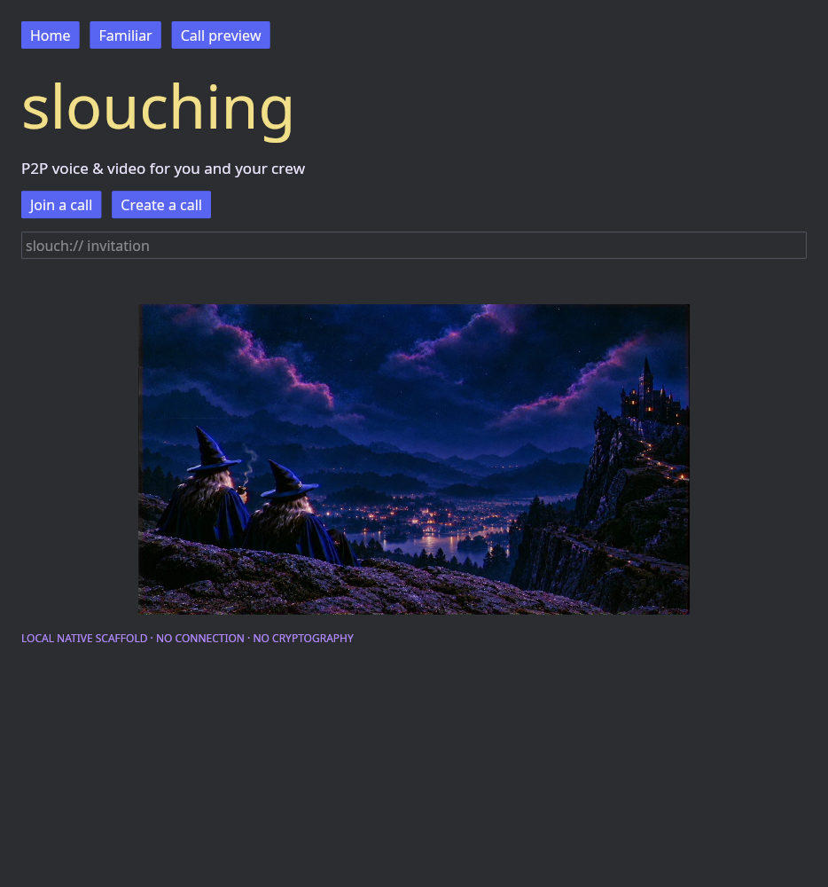

<p align="center">
  
</p>

<h1 align="center">slouching</h1>

<p align="center"><em>Pull up a chair. The internet can wait outside.</em></p>

<p align="center">
  
  
  
  
</p>

**Conceived by Rodrigo and Vitchola**, Slouching is a planned private place for a small crew to chat, call, and share a screen. Each person's computer is intended to run the client and peer core, own its keys and local history, and connect directly when possible. A crew may optionally operate its own helper for reachability or encrypted delivery. The project does not require a third-party Slouching server.

> [!IMPORTANT]
> This is an early build, **not a secure messenger**. The Rust/Iced frontend has three navigable preview views. The Rust backend has a loopback diagnostic API and a policy gate for *already verified* MLS commit envelopes. There is no working cryptographic identity, MLS, peer transport, encrypted chat, media call, or screen sharing.



The earlier local web preview remains available for design comparison. These are captures of that preview, with illustrative people and video tiles; they show no live peers or media.

| Web home preview | Web call layout preview |
| --- | --- |
|  |  |

## Repositories and documentation

This repository holds the project overview, design sources, and a reconciled documentation set. Product code lives in separate repositories, also listed as Git submodules here:

| Repository | Owns | Current state |
| --- | --- | --- |
| [slouching-frontend](https://github.com/slouching-org/slouching-frontend) | Native Rust/Iced desktop UI and web visual prototype | Three-view native scaffold; no core integration |
| [slouching-backend](https://github.com/slouching-org/slouching-backend) | Rust peer core and optional future helper | Commit policy gate and local status API only |

Start with the [fichas index](docs/fichas/README.md). The [peer-first specification](docs/fichas/architecture/backend.md), [frontend screen specification](docs/fichas/frontend/screens.md), [technology plan](docs/fichas/architecture/tech-stack.md), and [ADRs](docs/fichas/README.md#accepted-decisions) describe the target and distinguish it from working code. The [owner's 11-page architecture PDF](docs/fichas/architecture/sources/architecture-p2p-v0.1.pdf) and [page-by-page transcript](docs/fichas/architecture/sources/README.md) are preserved. Its Rust/Iced direction remains; its mandatory central Elixir/PostgreSQL server was superseded by the peer-first decision.

ADR 0004 changed the original single-workspace plan to [separate repositories](docs/fichas/architecture/adr-0004-separate-repositories.md). The [old workspace ADR](docs/fichas/architecture/archive/adr-0004-workspace-superseded.md) is retained only as history.

## Design sources

The [source bank](docs/fichas/brand/source-bank.md) includes the original HTML board, all eleven exported screens, original scene and avatar JPEGs, and five earlier visual references. The [visual style](docs/fichas/brand/visual-style.md) documents the palette and treatment. The two walking wizards are the primary pictorial logo; the hat is a provisional small icon. Screen exports are design targets, not working app states.

| Home reference | Group call reference |
| --- | --- |
|  |  |

## Run the current scaffolds

Clone each code repository at its latest revision, then follow its README. For a local checkout already containing both sibling repositories:

```sh
cd ../slouching-backend
cargo test --workspace
cargo run -p slouching-peer
# In another shell: curl http://127.0.0.1:3707/api/status

cd ../slouching-frontend
cargo check
cargo run
```

The backend listens only on `127.0.0.1:3707` and does not serve the frontend. The frontend currently does not link to the backend. Submodules in this repository pin snapshots; check each code repository for its current development state.
