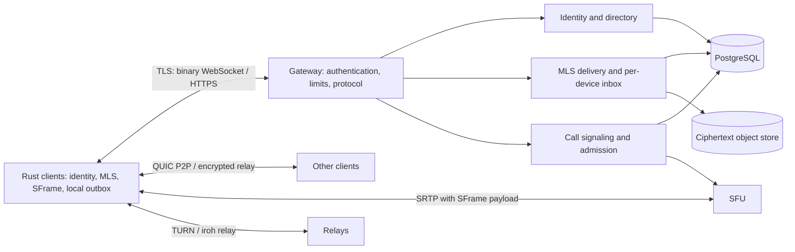

# Slouching original Elixir backend draft (historical)

> Historical draft based on the source PDF. The active stack direction is
> [Elixir backend with a Rust client](../adr-0005-elixir-server-core.md), with
> member-operated deployment permitted. This draft contains proposals that
> still require review and does not describe implemented service features.

**Status:** proposed architecture, implementation not started
**Revision:** 0.1, 2026-10-07
**Source:** `/home/amitis/Downloads/Arquitetura do sistema P2P de comunicação (v0.1)-2.pdf`, 11 pages, created 2026-10-06. This specification translates the source's goals into backend contracts and calls out assumptions requiring validation. The PDF is a design input, not proof that any security or performance property has been achieved.

## 1. Mission, scope, and non-negotiable properties

Slouching supports end-to-end encrypted text, images, audio, video, files, voice/video calls, and screen sharing, including groups, in v0.1. Each conversation is an MLS group, including conversations between two people. Each **device** is an MLS client. Rust clients perform cryptography; the Elixir backend coordinates identity, ordering, offline delivery, calls, and relay infrastructure. The backend does not receive plaintext messages, file keys, call media keys, or media frames before SFrame encryption.

The backend **will** learn unavoidable operational metadata: account and device identifiers, public credentials and KeyPackages, group routing identifiers and authorized device roster, message sizes, timing, delivery state, IP addresses, call participation, network candidates, and media routing/active-speaker data. TLS, storage encryption, log redaction, short retention, and access control reduce exposure; they do not make this metadata invisible. Direct P2P peers can learn each other's network addresses; clients must expose a relay-only privacy mode. Product copy must accurately describe these limits.

Availability, convergence, and authentic identity matter as much as encryption. A server cannot promise delivery after a recipient is offline indefinitely, after an explicit retention deadline, or during permanent storage loss. The API must expose pending, delivered, expired, and failed states without turning an accepted write into a false delivery claim.

The design is **not** a claim of formal verification, zero metadata, exactly-once network delivery, immediate revocation of media already received, or cryptographic erasure of copies held by participants.

## 2. Decisions and boundaries

| Area | v0.1 decision | Reason / boundary |
| --- | --- | --- |
| Service shape | One Elixir OTP application with a Plug/Bandit HTTP endpoint and binary WebSocket handler via WebSockAdapter; separate supervised domains, one release. | Keep one deployable unit while preserving module boundaries. No premature umbrella or microservices. |
| Durable authority | PostgreSQL transactions and constraints are authoritative for device state, group sequence, queue, and ACKs. | A GenServer or distributed registry must never be the only copy of security or delivery state. |
| MLS | Clients run OpenMLS; backend acts as Authentication/Delivery Service. Server serializes commit **acceptance** per group and distributes opaque MLS bytes. | The server cannot validate MLS cryptographic contents; clients must reject invalid commits and detect divergence. |
| Direct data | P2P is a transport optimization for ciphertext, never an alternate group-history authority. | A direct delivery cannot silently bypass group ordering or the durable queue contract. |
| Files | Clients encrypt before upload. Object storage holds ciphertext, identified by hash of ciphertext, with explicit references and garbage collection. | The server never receives file keys. Hashing plaintext would reveal equality across users. |
| Calls | Each call has a separate MLS group containing only participating devices; conversation MLS carries the invitation. Signaling and admission are backend services; media is direct for two endpoints when possible and through an SFU for larger calls. TURN is always available as fallback. | Conversation members who never joined a call must not derive call media keys. Topology changes do not themselves change E2EE keys, but media tracks/ICE/signaling still require migration. |
| Distributed runtime | Start on one node; scale gateway and workers horizontally using PostgreSQL plus cluster notifications. Add distributed registry only after measured need. | Process location is a cache, not an authorization or ordering primitive. |
| Retention | Define explicit, configurable offline message/file TTLs and surface expiration. | No indefinite storage promise or silent deletion. Product/legal retention choices remain open. |

### Architecture



All arrows from a client to server components carry authenticated requests; message bodies, file contents, and media remain client encrypted. The SFU terminates transport-level WebRTC security to forward RTP, so SFrame is the media E2EE boundary. It can read routing headers and must never decode SFrame payloads.

## 3. Threat model and trust

**Protect against:** network observers, a curious or compromised delivery/database/object-store operator reading user content, replay/duplication, a malicious directory substituting device keys, lost acknowledgments, ordinary node crashes, and an untrusted peer offering altered files or call-chat history. Abuse and denial-of-service must be bounded, although no service can prevent a capable adversary from dropping all traffic.

**Trust assumptions:** the Rust client and OS key store are uncompromised at the time of use; cryptographic dependencies are correctly implemented; users verify contacts' safety numbers or an independently auditable key-transparency mechanism; participants can always copy plaintext after decryption. A compromised Authentication Service can introduce false identities unless clients detect it. A malicious Delivery Service can delay, omit, and fork delivery even though it cannot forge MLS ciphertext. Membership and epoch mismatch must be surfaced as an error, not papered over by a server-side reset. [RFC 9420, sections 3 and 16](https://www.rfc-editor.org/rfc/rfc9420.html).

**Identity policy:** an account owns a signed device list. Existing devices authorize an added device through the pairing transcript; every device addition/removal increments a monotonically versioned account roster. Each device has a separately signed credential and signing key. Clients pin observed account identity and roster history; unexpected key changes trigger a blocking warning. Before public launch, a security review must decide whether safety-number verification is sufficient or an auditable key-transparency service is required. No silent trust-on-first-use reset.

**Unresolved release blockers:** define where the account identity private key lives, how it is backed up or deliberately lost, and how a user recovers after losing every device without allowing the server to impersonate them. Define a cross-device group checkpoint protocol: clients compare signed group ID, epoch, membership digest, and accepted sequence through an authenticated peer channel, then stop on divergence. Pinning alone detects changed keys on a device that has seen them before; it does not protect a first contact from a malicious directory. A public release cannot claim server-resistant identity or fork detection until these protocols and their user-facing recovery paths are specified and tested.

**Pairing:** SPAKE2 rendezvous tokens are single use, short lived, rate limited, bound to an intended action (contact pairing or device linking), and confirmed on both devices using a transcript-derived authentication code. Short human codes require explicit entropy and attempt budgets to be selected by review. QR transport carries enough randomness to avoid an online guessing channel. The rendezvous service only relays opaque handshake material. Cancellation, expiry, and retry are first-class states.

**Cryptographic rule:** do not invent cryptographic primitives or key derivations in the backend. Clients follow MLS RFC 9420, SFrame RFC 9605, and library-defined wire encodings. File-encryption format, nonce strategy, SFrame key schedule, media epoch overlap, and device-list signature format require reviewed interoperable test vectors before implementation is called secure. [RFC 9605](https://www.rfc-editor.org/rfc/rfc9605.html) states that SFrame depends on an external key-management framework and exposes some media metadata.

## 4. OTP application skeleton

```text
slouching/
  README.md
  docs/
    BACKEND_SPEC.md
    THREAT_MODEL.md             # before public beta
    OPERATIONS.md               # before deployment
    adrs/                       # decisions that change this contract
  proto/
    slouching/v1/
      common.proto              # envelope, errors, cursor, capabilities
      identity.proto            # device list, pairing, KeyPackages
      delivery.proto            # group log, inbox, receipts
      calls.proto               # admission, signaling, topology
      files.proto               # ciphertext upload/download lifecycle
  backend/
    mix.exs
    mix.lock
    config/
    lib/slouching/
      application.ex
      repo.ex
      identity/                 # account/device proof and revocation
      directory/                # public credentials, KeyPackage reservation
      groups/                   # group roster and ordered MLS commits
      delivery/                 # inbox, ACK, replay, expiry
      blobs/                    # signed upload/download and GC
      calls/                    # admission, topology, signaling
      telemetry/                # bounded, content-free events
    lib/slouching_web/
      router.ex                 # health, pairing, blob APIs, WS upgrade
      socket.ex                 # binary WS framing and connection limits
      auth.ex                   # per-device challenge and session
      protocol.ex               # decode, validate, version negotiate
    priv/repo/migrations/
    test/
      support/
      slouching/
      slouching_web/
      integration/
    rel/
  infra/
    compose.yaml               # local Postgres, S3-compatible store, TURN
    coturn/
    relay/
  scripts/
    dev-up
    check
```

The skeleton is a target layout, not a claim these files exist. Names may change through an ADR while the protocol and invariants stay explicit. Shared `.proto` files are the source for Rust `prost` and Elixir `protobuf` generation; CI rejects generated-code drift and incompatible field reuse. Dependency versions are selected and pinned at implementation time after compatibility and maintenance review. The source PDF itself warns its library list is from memory; notably current `iroh-blobs` documentation labels its newest line as not yet production quality and recommends an older line for that need. [iroh-blobs documentation](https://docs.rs/iroh-blobs/latest/iroh_blobs/).

### Supervision and process ownership

`Slouching.Application` supervises `Repo`, telemetry, bounded background workers, the HTTP/WebSocket endpoint, and `DynamicSupervisor`s for active call controllers and media participants. One process per connected device is owned by the socket runtime. Active group processes may cache live routing state, but dormant groups have no process. Never preload every group at startup. Crash recovery reconstructs from PostgreSQL; no security-sensitive state is only in ETS, Horde, or process memory. Call media state is ephemeral and can be rebuilt from clients after a crash. A failed participant process must not crash unrelated calls.

The group sequencing operation is a **database transaction**, not a GenServer mailbox guarantee: two nodes may accept simultaneously, a process may die between state change and broadcast, and distributed registration can split during partitions. A local group coordinator may reduce contention and wake sockets, but correctness comes from a row lock/CAS and unique constraints. Cluster PubSub is a latency hint; clients always repair from durable cursors.

## 5. Data model and retention

Store UUIDs as 16-byte values where practical; use UUIDv7 for externally generated sortable IDs but never use its order as proof of causality. All timestamps are UTC server timestamps. Client timestamps are display hints only. Tables below describe required constraints; exact SQL and indexes belong in migrations.

| Table | Required fields and constraints | Lifecycle |
| --- | --- | --- |
| `accounts` | `id`, identity public key, roster version, status; unique identity key | Explicit deletion/tombstone policy |
| `devices` | `id`, `account_id`, credential, signing key, roster version, revoked_at; unique credential/key | Revocation denies new sessions and tokens immediately |
| `device_roster_events` | account/version unique, signed change, actor device, time | Audit without message content; retention policy |
| `pairing_sessions` | random rendezvous ID, action, initiator, expiry, remaining attempts, state | Short TTL; secret material never logged |
| `key_packages` | device, MLS hash reference unique, bytes, expiry, `available/reserved/consumed`, reservation deadline | Atomic reservation; no normal reuse |
| `groups` | opaque group ID, next sequence, accepted epoch, state | Authorization and sequencing anchor |
| `group_devices` | group/device unique, admission state, join/remove sequence | Routing roster; server sees membership metadata |
| `group_events` | group + sequence unique, client event ID unique in group, sender device, kind, epoch, MLS ciphertext, digest, expiry | Commit/application order; bytes until policy permits GC |
| `inbox_entries` | device + event unique, delivery state, last attempt, ACK time | Created transactionally with event for eligible devices |
| `blob_objects` | ciphertext hash unique, byte size, storage key, uploader, state, expiry | Pending upload, sealed, then deleted when unreferenced |
| `blob_refs` | blob + group event unique, eligible recipients, expiry | Separate availability from message ACK |
| `calls` | group, opaque call ID, state, topology version, expiry | Minimal admission/signaling state; no media stored |
| `call_participants` | call + device unique, role, joined/left, media allocation | Short retention and cleanup |

Foreign keys, DB check constraints, and partial unique indexes enforce state transitions and duplicate prevention. Avoid application-only uniqueness. Every request is scoped by authenticated **device**, then by its account and current group membership. Never accept a device or account ID from a payload as authorization. Group ID guessing must reveal nothing; use the same externally visible error for unauthorized and absent groups where appropriate.

PostgreSQL and object storage need an orphan-safe two-phase file lifecycle: authorize upload and allocate bounded quota; client uploads ciphertext; server verifies ciphertext hash and size, then seals it; only sealed objects can be referenced by an accepted event; GC removes abandoned uploads and objects with no live refs after a grace period. S3/MinIO is never a source of authorization; pre-signed URLs are short lived and scope to one object and operation. Per-device access to a blob follows the authorized event/ref, not possession of a URL forever.

Retention values must be configuration backed by an explicit product policy. Proposed development defaults: pairing 10 minutes; unsealed uploads 24 hours; offline messages and sealed blobs 30 days; call signaling 24 hours after end; operational logs 7 days. These are **proposals**, not approved product promises. A recipient that missed a deadline receives a signed/authoritative expiration gap marker and must be able to recover group state or learn that recovery is impossible. A sender must see expiration rather than a fabricated delivered receipt. Backups and replicas need the same retention/deletion policy, including restore drills and deletion verification.

## 6. Protocol contracts

### 6.1 Framing, authentication, and versioning

One TLS WebSocket per connected device transports length-bounded binary protobuf envelopes. HTTP is used for bootstrap, pairing, KeyPackage management, and blob transfer. Authenticate by a server nonce signed with the registered device key over the nonce, domain, protocol version, session identifier, and expiry; issue a short-lived device-bound access token. Use WSS and HTTPS only outside local development. Reject revoked devices and replayed nonces. Reauthenticate on reconnect; tokens never appear in URLs or logs.

Every envelope has `protocol_major`, `protocol_minor`, `request_id`, `device_id` (authenticated context only), `kind`, and one typed payload. Responses include `request_id`, `status`, optional `retry_after`, and a stable machine-readable error. Unknown optional fields are ignored; unknown required capabilities or major versions are rejected with an upgrade error. Never recycle protobuf field numbers. Publish maximum envelope, ciphertext, KeyPackage, batch, and rate sizes before writing handlers. Disable compression for secret-bearing WebSocket payloads unless reviewed against side-channel risk. Apply per-IP, account, device, and group quotas with bounded socket mailboxes and slow-consumer disconnects.

Suggested stable operations: `AUTH_CHALLENGE`, `AUTH_PROVE`, `DEVICE_LIST`, `PAIR_START/FINISH`, `KEYPACKAGE_PUBLISH/RESERVE`, `GROUP_CREATE`, `GROUP_SUBMIT`, `GROUP_SYNC`, `INBOX_ACK`, `BLOB_ALLOCATE/SEAL`, `CALL_JOIN/LEAVE/SIGNAL`, and `HEARTBEAT`. Names and protobuf layouts are finalized in `proto/` before two independent clients are built. Return explicit `NOT_MEMBER`, `STALE_EPOCH`, `CONFLICT`, `KEYPACKAGE_UNAVAILABLE`, `RESOURCE_EXHAUSTED`, `EXPIRED`, and `UNSUPPORTED_VERSION` codes; do not encode these as free-form strings.

### 6.2 Group creation and MLS ordering

The client chooses a collision-resistant opaque group ID and creates the initial MLS state. `GROUP_CREATE` atomically records creator device and initial public routing roster, with an idempotency key. Server admission state is deliberately visible metadata; it is **not** inferred by decrypting an MLS message. Joining/leaving requires a signed control-plane authorization from a current permitted device, bound to group ID, roster version, targeted devices, and the MLS commit hash. The server checks permission and records the planned roster transition only when the corresponding commit is accepted. Clients independently verify that the authenticated MLS membership and server roster agree; mismatch blocks sending and alerts the user.

`GROUP_SUBMIT` includes group ID, event ID, sender device, expected server epoch and predecessor sequence, event kind (`application`, `proposal`, `commit`, `welcome`), opaque MLS bytes, and a digest. In one transaction, lock the group row, validate sender/authorization and size, deduplicate by `(group_id, event_id)` plus digest, reject a same-ID/different-digest replay, compare expected epoch/sequence, append the event, apply an authorized roster/epoch transition, and create per-recipient inbox rows. Commit before acknowledging acceptance. Only then broadcast a notification. Concurrent commits to the same predecessor yield one acceptance and one conflict; the loser client resyncs and constructs a fresh valid commit. A rejected commit is **never** silently rebased by the server.

Use a per-group monotonically increasing `server_sequence` for delivery, with `accepted_epoch` as a claimed routing value. The server cannot prove an opaque commit is cryptographically valid or that its declared MLS epoch matches its contents. Clients must validate on receipt and quarantine a group on mismatch. A single group log includes application and handshake messages in the order clients need; `Welcome` is routed to specifically added devices and linked to its accepted commit. A new member cannot read prior epoch content merely from server history. A leaving member receives no future event payload after the authorized removal sequence, while already delivered material remains outside server control.

KeyPackage reserve is atomic and scoped to an authenticated requester and intended invite, with a short lease. Consumed regular packages never return to the available pool. Expired leases are reconciled with the invite/commit outcome; reuse is prohibited unless the protocol explicitly uses a separately identified last-resort package. Clients replenish packages and verify package signatures, lifetimes, identity binding, and capabilities. [OpenMLS KeyPackage guide](https://github.com/openmls/openmls/blob/main/book/src/user_manual/create_key_package.md); [OpenMLS add-members guide](https://book.openmls.tech/user_manual/add_members.html).

### 6.3 Delivery, replay, and receipts

Acceptance means committed to durable server storage, **not** delivered or decrypted. Each eligible destination device has its own inbox entry. On reconnect, client supplies its last contiguous `server_sequence` per group or an opaque cursor; server streams bounded pages in order. Socket pushes are hints. An ACK includes group, sequence, event ID, device ID from auth context, and a monotonic client-reported stage: `received_persisted` or `processed`. The client sends `received_persisted` only after durable local write; this stage is sufficient for queue GC if product policy agrees. A processed/read receipt is a separate client-encrypted MLS application event, never inferred from transport ACK.

At-least-once transport is the actual guarantee. Client outbox retries an event with the **same** ID and bytes; server deduplicates by constraint and returns the original sequence. Client inbox deduplicates before applying MLS state and re-ACKs duplicates. A crash after DB commit but before socket reply is repaired by retry; a crash after socket push but before ACK is repaired by replay. Direct iroh delivery can speed arrival, but the event must also be accepted into the authoritative server log for offline/cross-device consistency. A peer receipt does not delete another device's inbox entry. The UI may show 'delivered to device(s)' only for actual device ACKs; 'read' requires explicit encrypted consented receipt policy.

Purge an event's ciphertext only when its eligible device inbox entries are ACKed or its TTL expires, while preserving a minimal, time-bounded sequence/digest/tombstone needed for cursor continuity and deduplication. Group history for a newly linked device requires an explicit client-side history transfer policy; server ciphertext alone cannot give the new device old MLS epoch keys. Deletions and attachments need their own lifecycle semantics. If retention expires before a device catches up, return a gap with `EXPIRED` and force explicit recovery; never replay later MLS events into an unrepairable old state as though nothing happened.

### 6.4 Blob transfer

Clients generate a random file key, encrypt in authenticated chunks with a reviewed format, then compute a BLAKE3 hash over **ciphertext**. The MLS event contains the file key, ciphertext hash, length, media type as chosen by client, and chunk/authentication metadata. The server verifies stored bytes match the declared ciphertext hash and enforces quotas. Hash verification detects storage corruption but does not replace AEAD authentication or prove a sender's claims about content. Clients treat names and media types as untrusted. P2P/iroh transfers and server downloads use the same hash and authentication checks. Object storage may be one source; availability to every offline device depends on retention and server storage, not on peers remaining online.

### 6.5 Calls, SFU, and ephemeral call chat

Call invitation and high-level call state are MLS application events in the persistent conversation. **The call has its own MLS group**, whose members are exactly the currently admitted devices; SFrame derives keys from this call group's MLS exporter, not from the wider conversation. Adding or removing a call participant advances the call MLS epoch, independent of conversation membership. A signed, call-scoped admission decision binds the conversation group, call ID, device, call MLS membership transition, and expiry. The backend authorizes `CALL_JOIN` using the device's current conversation roster and the call policy, then issues a short-lived, call-scoped media admission token only after the call-group transition is accepted. Clients verify call-group membership before sending media. Call signaling (SDP/ICE, track metadata, topology version) is bounded, authenticated, and short lived. The server learns participation and routing details but no call content. A removed device loses future admission/signaling and future media keys after clients process a valid call MLS epoch change; in-flight/previously buffered media cannot be revoked retroactively. Clients pause sending on a removal transition until key rotation is effective and report stalled peers.

For two participants, attempt direct WebRTC with TURN fallback. At three or more, allocate SFU resources; on topology change, overlap old and new paths until the new path is ready, then switch by monotonically increasing `topology_version`. Migration can cause a brief interruption and needs ICE/track renegotiation even though SFrame key management stays with MLS. Simulcast/SVC, active-speaker selection, and layer switching must be measured on real clients; ex_webrtc provides forwarding building blocks, not a finished production SFU. [ex_webrtc forwarding guide](https://ex-webrtc.hexdocs.pm/forwarding.html). SFrame KIDs, replay windows, sender/epoch binding, and key rollover follow [RFC 9605](https://www.rfc-editor.org/rfc/rfc9605.html).

The room-only chat is separate from the persistent group log and is never written to the backend database or object store. The server may relay ciphertext but has no durable queue, ACK guarantee, or history. Clients hold a bounded in-memory log. A joining participant can receive old messages only through a **new, explicit** re-encryption by an existing peer under the new epoch; this shares past plaintext with the newcomer and therefore requires a clear product consent rule. Signature/hash chaining detects alteration of supplied entries but **cannot prove that a serving peer did not omit entries** without an independently known checkpoint. HLC + UUIDv7 gives a deterministic display sort, not universally agreed causal order. If the last copy disappears, history is gone; a global crash may erase the room chat even while the call can be rejoined. The backend must not promise stronger behavior.

## 7. Security and abuse controls

- Enforce device-bound authorization at every HTTP/WS operation, object URL issuance, call admission, and relay token mint. Recheck authorization at operation time; revocation invalidates sessions and prevents new resource access.
- TLS with modern configuration, no plaintext public endpoints, secrets from a managed secret store, separate database/object/relay credentials, least-privilege roles, encrypted backups, and documented key rotation.
- Never log ciphertext bodies, KeyPackages in full, pairing transcripts, access tokens, signed challenges, SDP/ICE payloads, filenames, or network addresses by default. Metrics use aggregated/bounded labels; avoid group, account, device, or blob IDs as labels.
- Bound untrusted sizes, decode nesting, fanout, membership changes, pending KeyPackages, simultaneous calls, SFU bitrate, object bytes, and per-tenant queue growth. Apply backpressure before mailbox/memory exhaustion; deny or shed new work predictably.
- Abuse reporting/blocking needs a separate product policy because the server cannot inspect content. Provide user-controlled blocking and account/device rate limits in v0.1. Avoid claiming server-side content moderation.
- Protect relay endpoints from open-relay use with expiring device/call-scoped credentials and bandwidth quotas. Separate media, signaling, and database failure domains operationally.
- External cryptography and media code receive dependency scanning, reproducible builds, fuzz/property testing at parsing boundaries, and an independent security review before public release.

## 8. Operations and observability

Liveness means the BEAM node is running; readiness means it can accept new work **and** reach PostgreSQL and essential object storage. Do not mark readiness healthy when writes would be lost. Migration execution is a one-off release task, never run independently by every node on boot. Prefer expand/migrate/contract schema changes and protocol capability negotiation for rolling deploys. Database PITR, object versioning/lifecycle, backup encryption, and restore drills are mandatory before handling real users.

Capture content-free telemetry for authenticated connections, group submit latency/conflict rate, pending inbox age, replay count, KeyPackage stock and reservation failures, object upload/orphan count, call setup success/latency, ICE/TURN/SFU route share, media loss/jitter, SFU CPU/packet forwarding, BEAM mailbox lengths, DB pool saturation, and error rates. Trace IDs may link operations but must not become persistent user identifiers in logs. Alerts should follow user-visible failure: backlog age, stalled group convergence, expired deliveries, failed restores, and call setup failures.

Initial SLO **candidates**, to validate in a measured pilot: 99.9% monthly availability for auth and accepted-message writes; p95 accepted-message latency below 300 ms in the primary region; p95 call setup below 5 s on supported networks. The PDF's 100 ms P2P, 150 ms mouth-to-ear audio, and <1 s call start are **aspirational performance targets**, not architectural guarantees. Establish measurement definitions and device/network test matrix before promising them.

## 9. Verification and release gates

**Foundation gate:** clean checkout can start local Postgres/object store, run migrations, generate protobuf for Elixir/Rust, and pass formatting/static checks. An integration client can register two devices, pair them, create a two-member MLS group, exchange encrypted text, and survive server restart without losing accepted events.

**Correctness gate:** property/integration tests cover duplicate IDs with same/different bytes, parallel commits from two nodes, stale epochs, one-time KeyPackage races, crash at every commit/push/ACK boundary, reconnect replay, slow consumer, revocation during delivery, multi-device recipient, TTL expiration and gap recovery, backup restore, and roster/MLS mismatch. Test by inspecting both database constraints and client-observed behavior. A server-only mocked MLS test is insufficient.

**Security gate:** interoperable client test vectors for identity and MLS/SFrame/file formats; malicious server and peer tests for key substitution, omitted/forked events, replay, reordered commits, forged ACKs, blob corruption, bogus call admission, and relay abuse. Independent review resolves any blocking finding before public use.

**Media gate:** two-client direct/TURN audio with echo, loss, jitter, reconnect, and network migration; three-or-more-client SFU call with simulcast selection, call-group epoch rotation on removal, SFrame confidentiality check at SFU, screen share on supported platforms, and load tests with documented capacity limits. Test that a conversation member who never joined the call cannot derive its media keys. Reject release if server can access decoded content or a removed participant can decrypt media after the effective new epoch.

**Launch gate:** documented incident response, deletion/retention policy, privacy copy matching observed metadata, restore exercise, operational runbooks, quotas, alerting, and a staged rollout with rollback. A feature is incomplete when its failure state cannot be explained to a user.

## 10. Implementation order and open decisions

1. Set up app skeleton, local services, protobuf generation, CI, and data migrations. Draft threat model and security review checklist before implementing crypto interfaces.
2. Implement identity, authenticated device sessions, signed roster, pairing, KeyPackage reservation, and group admission. Validate client interoperability.
3. Implement transactional group log, per-device inbox, cursor replay, ACK, expiry, and two-device encrypted text. Prove crash and concurrency behavior before P2P optimization.
4. Implement encrypted blob lifecycle and direct iroh delivery with authoritative server-log anchoring. Prove offline availability and corruption handling.
5. Implement call admission/signaling, TURN, direct audio, SFrame, then video/screen; benchmark against realistic networks.
6. Add SFU, topology transitions, multi-person calls, ephemeral room chat, and failure recovery. Complete security review and rollout gates.

Decisions requiring product/security input before finalizing protobuf and public promises:

| Decision | Why it matters | Safe provisional direction |
| --- | --- | --- |
| Identity trust and key transparency | Server-controlled key substitution undermines E2EE | Pin and warn on changes; require review before public launch |
| Lost-all-devices recovery | Account key recovery can become server impersonation | No silent reset; specify custody and recovery before public beta |
| Group fork detection | A malicious delivery service can show different histories | Authenticated cross-device checkpoints; stop on divergence |
| Cross-device history | New MLS devices lack old epoch keys | Explicit consented client-to-client transfer, disabled by default |
| Group roles and invitation authority | Backend admission must match user expectations | Only existing authorized device may invite; explicit signed roster transition |
| Offline TTL, backups, deletion | Availability and privacy conflict | Configurable finite TTL, visible expiry, audited deletion |
| Call-chat history for late joiners | Re-encryption reveals prior content to newcomers | Do not share prior history by default without consent |
| Read receipts and presence | Potential privacy leak | Off by default until product policy exists |
| Federation/anonymous access | Changes authentication, abuse, metadata, and protocol | Outside v0.1 until separate design |
| Max group/call/file sizes and SLOs | Determines schema, quotas, SFU capacity | Measure in pilot; publish tested limits |

Frontend choices, user journeys, accessibility, and product language are intentionally left for the forthcoming frontend information. The backend contracts above should be revised through ADRs when those requirements expose a conflict.
