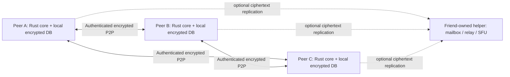

# Slouching peer-first backend specification

> **Superseded architecture proposal.** The owner's PDF and explicit stack
> correction assign the service backend to Elixir. See
> [ADR 0005](adr-0005-elixir-server-core.md) and the [current service
> boundary](elixir-backend.md). This document remains for traceability and
> does not define the current backend implementation.

**Status:** architecture proposal; only a local scaffold and commit-chain policy gate are implemented
**Revision:** 0.3, 2026-10-07
**Requirement clarified by the project owner:** friends run Slouching on their own connected computers, over local Wi-Fi or the internet, without depending on a third-party Slouching server. A friend may optionally run a helper for their group.
**Source input:** the [complete owner-provided PDF](sources/architecture-p2p-v0.1.pdf), with a [page-by-page transcript](sources/README.md). Its Rust/Iced client, cryptography, and feature goals remain inputs; its mandatory central Elixir/PostgreSQL server is superseded by the peer-first requirement. The previous interpretation is preserved in [the archived draft](archive/centralized-draft.md). See the [technology stack](tech-stack.md) and [ADRs](../README.md) for current decisions.

## 1. Product promise and precise limits

Every peer runs the application and its protocol core. The peer owns its identity keys, MLS state, encrypted local history, outgoing queue, and copies of encrypted data it agrees to retain for friends. A group has no required vendor-operated account, database, rendezvous, relay, or ordering service. A peer may volunteer to be a continuously available mailbox, rendezvous point, relay, or media forwarder, but ordinary conversations must still function among reachable peers when that helper disappears.

**No third-party dependency** means Slouching does not require infrastructure operated by Slouching or another provider for the supported connection paths. It does not mean that any two computers on the internet can always connect with no reachable intermediary. On the same LAN, peers can discover or exchange addresses locally. Across the internet, peers need a workable direct route (for example public IPv6 or a forwarded port) or a reachable relay hosted by a participant. If none exists and NAT/firewall conditions block direct links, that pair cannot communicate until a route becomes available. The app must report this honestly.

Likewise, an encrypted message remains on its sender's device until another authorized peer or a chosen mailbox receives it. If no copy can reach a recipient, delivery waits. No device or helper can promise availability when every holder of the ciphertext is disconnected or loses its data. **The product does not require messages to stay available after all holders leave or discard their copies.** A live call requires the participants to be connected; a peer acting as SFU must have sufficient uplink and CPU.

This proposal preserves the source document's aim of end-to-end encrypted chat, files, voice/video calls, screen sharing, and groups. The technical route to those features changes: the Rust core is the network service on each computer; an Elixir helper is an **optional deployment**, never the authority required for normal operation. Current v0.1 scope and release criteria must be approved against the new availability tradeoffs before implementation.

## 2. Core architecture



Each installed app can listen for peers while it is running, and can initiate outbound connections. A helper is another authorized node with an explicit role and quota; it is not a trusted decryptor. One user's ordinary app may serve this role. A headless edition may run the same protocol on a friend's always-on PC **or on a VPS rented and administered by a group member**. A separate Elixir implementation is permissible later as a protocol-compatible convenience service, not a prerequisite and not the source of truth for clients' private state.

On a VPS, the headless node can provide a stable public address, encrypted mailbox storage, rendezvous, a traffic relay, and (if its capacity permits) an SFU. Group members explicitly authorize those roles and set storage, bandwidth, and retention limits. The node has its own transport identity but holds no member's account private key, MLS group secret, file key, or SFrame media key. The VPS provider can observe network and resource metadata and may access stored ciphertext; end-to-end encryption must still hold if the VPS is compromised. A VPS outage removes those conveniences, not the ability of peers with another working route to communicate. If the VPS is the group's **only** route across restrictive networks, internet connectivity will pause until it returns or another route is configured.

| Responsibility | Required location | Optional helper role |
| --- | --- | --- |
| Private identity, MLS, file and media keys | User's own devices | Never receives private keys |
| Conversation history and outbox | Encrypted local DB on each participating device | Ciphertext-only replicas with agreed TTL |
| Peer discovery | LAN discovery, authenticated invitation, or exchanged endpoint addresses | Publish reachable address to invited peers |
| Transport | Direct authenticated QUIC; direct WebRTC for media | Relay when direct route fails |
| Group membership/MLS commits | One designated member device per group creates Commits; other devices validate and sync | May carry proposals and checkpoints, but never creates Commits or decides group state |
| Files | Encrypted chunks on sender/receivers | Optional ciphertext cache |
| Group media | Client mesh where feasible | Optional friend-hosted SFU |

There is **no central PostgreSQL requirement**. A local encrypted SQLite database is appropriate for each app. SQLite transactions provide local crash safety; peer replication and signed protocol state provide cross-device convergence. A volunteer helper may use SQLite too. PostgreSQL is an optional operational choice for a larger helper deployment, with no client-visible guarantee depending on it.

## 3. Trust and security model

Each device owns a long-term signing identity and its own MLS leaf. Account-level identity, signed device roster, and recovery policy are open security design decisions. Pairing must authenticate the exchanged keys using a scanned QR code or a reviewed short-code protocol with explicit entropy and attempt limits. Devices pin observed contact identity and surface unexpected changes. An unaudited peer directory cannot be treated as an identity authority.

Initial onboarding creates and persists a local device identity and presents its fingerprint. A display name and familiar/avatar are local profile choices; no account or email is required to start. The frontend must not label a newly generated identity as verified by friends until they compare authenticated key material. Recovery and moving that identity to another device remain explicit security decisions, not implicit account login.

Every conversation, including a two-person one, is an MLS group. Clients create, validate, and store MLS state locally. Messages and files leave a device encrypted. A peer holding a mailbox copy can read routing metadata, timings, ciphertext size, and the identities of peers it directly communicates with. Direct connections reveal network addresses to the connected peers. Local database encryption protects at-rest copies but cannot protect plaintext while a compromised endpoint is displaying it.

Separate call MLS groups contain only admitted devices; the larger conversation MLS group carries call invitations. Media keys come from the call group's MLS exporter. A conversation member who did not join a call must not be able to derive its media keys. Group media forwarders see transport metadata and SFrame headers, never decoded media. [MLS protocol](https://www.rfc-editor.org/rfc/rfc9420.html); [SFrame](https://www.rfc-editor.org/rfc/rfc9605.html).

No peer, including a helper, may silently reset another peer's identity or rewrite a group history. Peers exchange authenticated group checkpoints (group ID, epoch, membership digest, accepted commit hash, and application-log position). A mismatch quarantines the group and explains the conflict to users. Checkpoints detect some forks when peers meet; they cannot force a malicious or disconnected peer to cooperate. Identity recovery after all devices are lost must be specified separately without granting a helper impersonation power.

## 4. Connection modes

### Same Wi-Fi / LAN

Discover running peers locally or connect using an invitation carrying their authenticated endpoint identity and address. Local discovery is a hint only; never trust a discovered name or IP without verifying the pinned device key. Transfer encrypted data directly. No internet, hosted server, public DNS, or outside relay is required for this mode.

### Internet, direct route available

Use an invitation, QR code, or previously exchanged signed address record to learn a peer's current endpoint address. Attempt direct authenticated QUIC for data and ICE/direct WebRTC for calls. Address changes are advertised through already authenticated peers or fresh signed records. Implementations must allow manual address exchange and must not silently enable a third-party discovery or relay service by default. Current iroh documentation notes that connecting by endpoint ID still needs a relay URL or direct addresses; this is why bootstrap is an explicit part of the design. [iroh documentation](https://docs.rs/iroh/latest/iroh/).

### Internet, direct route blocked

Use a participant-operated reachable relay **only if the group chooses one**. The relay passes encrypted bytes and can be replaced by another authorized peer. A friend with a publicly reachable PC, router port forwarding, or suitable IPv6 connectivity can provide this route. The group may also choose a self-hosted standalone relay; the app must identify who operates it and what metadata it sees. A connection must fail visibly if no permitted route works. Iroh supports custom relays, while its default public relays are external infrastructure and must not be an invisible dependency of this mode. [iroh relay guidance](https://github.com/n0-computer/docs.iroh.computer/blob/main/add-a-relay.mdx).

## 5. Delivery and replication

Each client maintains a durable encrypted outbox and inbox in its own SQLite database. Every application event has a stable random ID, author device, group ID, MLS epoch, parent/checkpoint reference, ciphertext digest, and bounded expiry policy. Sender retries preserve the same ID and bytes. Receiving peers commit locally before ACKing; repeated events deduplicate by ID and digest. A same ID with different bytes is an attack/error. A peer may ACK receipt without claiming the user read the message.

For an online group, sender transmits directly to reachable members. A participating peer can accept delegated ciphertext copies for temporarily unreachable members, with a signed delegation and explicit quota/TTL. The sender may then go offline; the holder forwards when it later meets the recipient. Multiple holders improve resilience, but replication is optional and **not a promise of permanent availability**. A helper does exactly this more continuously. Each holder reports **which copy it durably stored**, not that the final recipient received it. Receipts show `local`, `held by peer`, `received by device`, `read if enabled`, `expired`, or `failed`; no network-wide exactly-once claim.

Replica placement is a product choice, not an automatic privacy-free operation. The sender should know which devices are asked to hold ciphertext, how much, and for how long; recipients may decline storage. A group policy chooses replication factor, storage budget, retention, and whether attachment chunks may be cached. A new member does not automatically gain previous MLS epoch keys or history. Peer-to-peer history transfer requires explicit authorization and a reviewed format.

Every holder persists received ciphertext and receipts before advertising possession. On reconnect, peers exchange bounded inventory summaries and request missing events/chunks, verifying signatures, MLS membership, and ciphertext hashes. The algorithm must account for malicious omission: a peer's statement that it has a complete history is not proof. Signed checkpoints and comparisons among multiple peers detect divergence when possible. Garbage collection waits for policy-defined receipt/expiry conditions and preserves enough tombstones for deduplication and gap reporting.

## 6. MLS commit rule: one designated member device (v0.1 decision)

Ordinary application events can be delivered and displayed with an explicit deterministic display order; network order does not prove causality. **Membership and key-changing MLS Commits are different:** all devices must settle on one Commit for each epoch. The [MLS architecture](https://www.rfc-editor.org/rfc/rfc9750.html#section-5.2) permits a strongly ordered Delivery Service as well as peer-to-peer delivery. Slouching v0.1 uses a single writer **inside each MLS group** to obtain a linear commit chain without a central Slouching server.

The creating member device is recorded as the group's **designated committer** in the signed group-creation policy. This is a device, not merely an account or display name. It is an actual MLS member holding that group's cryptographic state. Only this device may produce a Commit accepted by Slouching clients for that group. Other members may send authenticated MLS Proposals (including requests for their own key updates) to it; they may also send ordinary encrypted application messages directly to each other. The committer checks group policy, collects valid proposals, creates one Commit from the current epoch, durably records its new local MLS state and the exact outbound bytes, then distributes the Commit and any matching Welcome messages. It must not construct a second Commit from a pending predecessor state. The implementation must define and test an atomic local persistence/retry boundary for its MLS state and outbound log before this flow is safe.

Each Commit is bound to its group ID, predecessor epoch and commit hash, author device, and resulting checkpoint. Peers validate both the designated-committer policy and the MLS cryptography, process Commits in chain order, reject a noncommitter's Commit, and request any missing predecessors before applying later events. A new member processes a Welcome only if it matches the accepted Commit. Duplicate delivery of the same bytes is harmless; the same predecessor with different Commit bytes from the designated committer is **equivocation**, so clients quarantine the group and show a security error. A helper or VPS may transport and cache this opaque chain but has no authority to create it. Peers compare signed checkpoints when they meet to detect withheld or divergent histories.

The committer's local durable record establishes the chosen Commit; **delivery and adoption are separate states**. The app must show which devices have processed it. A disconnected device catches up from the committer or another authorized holder before sending new group traffic. If the committer is temporarily unavailable, other members queue proposals and cannot finalize membership changes or MLS key updates; ordinary messages may continue under the last agreed epoch if no removal or suspected compromise is pending. If a removal or compromise is pending, clients pause sending rather than claim immediate revocation. A removed device may still have old ciphertext and old keys; clients must not promise retroactive secrecy or instant removal across a network partition.

There is **no automatic failover, timeout election, or invisible successor** in v0.1. If the designated device is permanently lost or untrusted, remaining verified members create a **new MLS group with a new group ID** and explicitly invite its intended members. The old group is marked unavailable for new key changes; any locally retained old history stays labeled as belonging to that old group. Planned transfer of the committer role within the same group requires a separately reviewed authenticated handoff protocol and is outside v0.1. This makes loss visible and avoids pretending that a helper or a second peer inherited cryptographic authority.

This rule trades availability of group changes for a smaller consistency protocol. It does not prevent a malicious designated committer from withholding updates or sending conflicting chains; checkpoint comparison detects some equivocation after peers exchange evidence. The group-creation policy, proposal authorization, Commit/Welcome binding, crash recovery, and compromise response remain **implementation and security review gates**, even though the architectural choice is now settled. In particular, noncommitter update proposals cannot heal a compromised key until the committer includes them in a valid Commit.

## 7. Calls, files, and temporary room chat

Two reachable endpoints attempt direct WebRTC; a group may use mesh for small calls within measured bandwidth limits. At larger sizes, a friend-owned peer may act as an SFU and forward SFrame-protected media. If no suitable peer is available, the app must state the supported participant limit or degrade quality; it must not pretend an external SFU exists. Moving from mesh to SFU requires ICE/track migration even when the MLS media key is unchanged. The device that creates a call's separate MLS group is its designated committer. If that device leaves or becomes unavailable, further call membership changes pause; a new call group can be created explicitly if participants want to continue. Device join/leave advances the **call** MLS epoch. Removals pause outgoing media until the new key is effective; previously received media cannot be revoked.

Files are encrypted and authenticated by the sender, split into bounded chunks, and verified by ciphertext hash plus the client AEAD format. Peers may fetch from several authorized holders. A holder sees sizes and access timing. Do not hash plaintext for a public address. Storage quotas prevent one friend from exhausting another's disk. If no holder has the data, the app reports the attachment unavailable.

Room-only chat stays in RAM on participating devices, with no durable outbox unless users opt into a different, persistent conversation feature. A late joiner does not automatically see prior messages; sharing them requires a participating peer to re-encrypt them into the new call epoch and a clear group consent rule. A hash chain can reveal changed supplied entries but cannot prove that a peer supplied every entry. When every in-memory copy is gone, the room history is gone. More generally, the app must distinguish **disconnecting** from **deleting**: leaving a call or closing the app does not silently erase a persistent local conversation, while a room explicitly marked temporary may disappear after its last participant leaves.

## 8. Code and process skeleton

The [workspace map](workspace.md) distinguishes current code from the target.
The backend now lives in a standalone repository. The frontend lives in
`slouching-org/slouching-frontend`. A possible future backend layout is:

```text
slouching-backend/
  Cargo.toml
  peer/                           # current Rust binary and library
  crates/
    identity/                     # device keys, pairing, signed roster
    crypto/                       # MLS, SFrame, file encryption adapters
    store/                        # local encrypted database and migrations
    protocol/                     # versioned peer wire protocol
    network/                      # discovery, QUIC, optional relay
    sync/                         # outbox, ACK, replicas, checkpoints
    groups/                       # commit agreement and fork detection
    files/                        # encrypted chunks
    calls/                        # signaling, ICE, topology, SFrame
    core/                         # UI-independent orchestration
  helper/                         # optional headless peer
  docs/fichas/                    # domain notes and ADRs
```

Only `peer/` exists today. The expanded crates are a target, not implemented
files. The eventual core exposes intent/state APIs to the separately
versioned frontend. Network, cryptography, local storage and call media
should be independently testable. Media capture and encoding belong off
UI/database threads. A helper is built from compatible protocol crates and
remains optional. An Elixir helper, if ever built, must pass the same
conformance tests.

The `peer/` directory holds peer code, not a mandatory central server.
No PostgreSQL service is a normal startup dependency. The finished app should
start and communicate on a LAN without an internet route. A helper may run on
a group member's PC or private VPS. Dependency choices require feasibility
and security review; the PDF's list is not a lockfile.

## 9. Verification gates

1. **Local-only:** two clean peers on an isolated LAN discover or connect via QR/address, verify identities, exchange encrypted text and files, restart, and preserve local history. Network capture shows no contact with public discovery or relay hosts.
2. **Reachability:** peers across separate networks connect using only a participant-operated public endpoint or relay. When the endpoint disappears, already connected direct peers continue and a new permitted route can be selected; when no route exists, the UI reports unreachable.
3. **Delivery:** multiple devices, duplicate events, power loss before/after local commit and ACK, delegated ciphertext holding, unavailable holders, expiration, corrupt chunks, and storage quota exhaustion produce truthful states.
4. **MLS commit rule:** concurrent proposals from members produce one committer-authored chain; noncommitter Commits are rejected. Test unknown proposals, crash at local-state/outbox boundaries, duplicate and withheld Commits, committer equivocation, matching Welcome delivery, network partitions, member removal, new device join, and permanent committer loss followed by an explicit new group. No public release before the local persistence and compromise rules pass review.
5. **Media:** two-person direct call; small mesh group; optional peer-hosted SFU; call MLS membership and key rotation; screen share; NAT/ICE failure; bandwidth and CPU limits on the helper. Verify the helper cannot decode SFrame media.
6. **Security:** review key custody, pairing, file format, group fork handling, identity substitution, local database encryption, helper admission, abuse quotas, and dependency supply chain. Test with malicious peers and a dishonest helper.

## 10. Open choices that need a decision

| Question | Why it matters | Current safe position |
| --- | --- | --- |
| Is any third-party relay allowed as an explicit opt-in? | Changes reachability and metadata exposure | Disabled by default; participant-owned routes only |
| Must every app serve peers while open, or can a user turn serving off? | Affects replication and battery/disk use | Serving and quotas are visible user choices |
| Can the designated committer role ever move within the same group? | Safe transfer needs a reviewed handoff protocol | No in v0.1; create a new group if the device is permanently lost |
| How are identity keys recovered after all devices are lost? | Could let a helper impersonate a user | No silent reset; explicit recovery design required |
| How much ciphertext may friends store for others? | Privacy, storage, and delivery claims | Opt-in quotas and finite TTL |
| Which conversations are persistent versus temporary? | Closing an app must have predictable consequences | Persistent local history by default; explicitly temporary rooms may vanish |
| What size of mesh call is supported without an SFU? | Depends on uplink/CPU of ordinary PCs | Publish measured limits, not guessed ones |

The frontend requirements can refine these choices, but cannot make a blocked internet route, absent copy of a message, or split MLS epoch disappear. The product must expose those states honestly.
